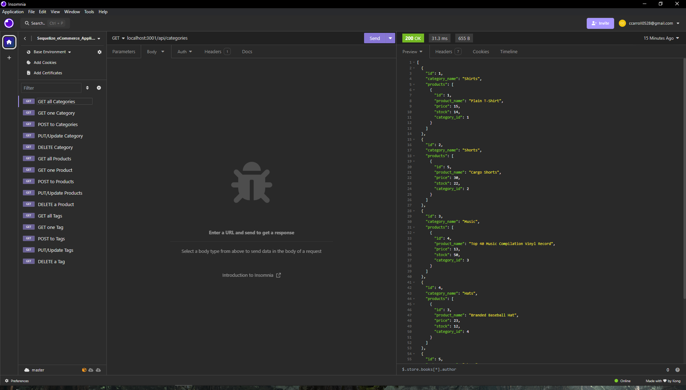

# Sequelize eCommerce Application

  ## Table of Contents
  * [Description](#description)
  * [Installation](#installation)
  * [Usage](#usage)
  * [Contributing](#contributing)
  * [Questions](#questions) 

## Description
  This e-commerce application uses an Express.js API, Sequelize, and MySQL2 to create and connect to an e-commerce database that allows users to view, post, update, and delete categories, products, and product tags with HTTP requests. 
 
 

Watch a [video demonstration](https://drive.google.com/file/d/1rUU7F__6iY28_lvrhhNv1igIrlLlMVDv/view) of the application's functionality
## Installation
  * [Insomnia](https://insomnia.rest/download) or similar program is needed to make HTTP request to the server
  * [Node.js](https://nodejs.org/en). Use command "node -v" in the terminal to see if already installed
  * [MySQL](https://dev.mysql.com/downloads/installer/). Use command "mysql -V" in the terminal to see if already installed.
  * Use command "npm install" in the terminal to install all dependencies
  * Use command "npm run seed" to seed that database
  * Create an .env file in root directory and type "PASSWORD='YourPasswordHere'" and replace the text in single quotes with your valid mySQL password. 
  * Use command "mysql -u root -p" in the terminal and then enter your password when prompted
  * Navigate to the "./db" directory and enter the command "source schema.sql" in the MySQL shell to access the MySQL database

## Usage
  * Open terminal in the root directory and run "npm start"
  * Open Insomnia and create a new HTTP request 

## Contributing
  Fork the repository to contribute

  ## Questions
  Contact info:
  [GitHub Username](https://github.com/ccarroll929) 
   
  [Email: ccarroll0528@gmail.com](mailto:ccarroll0528@gmail.com)